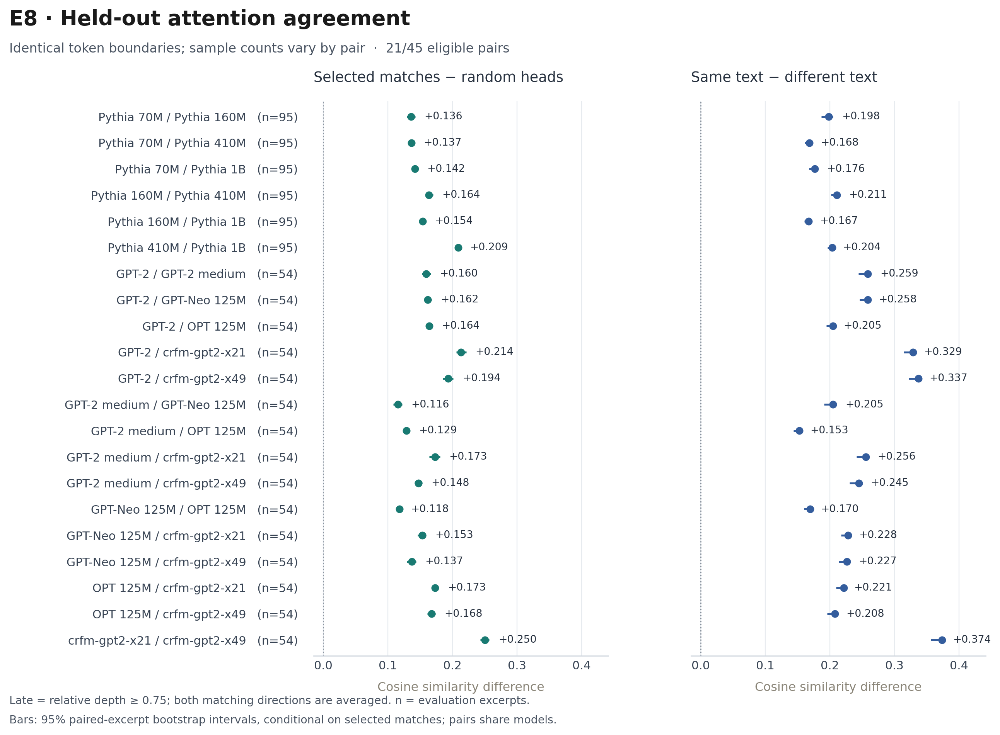
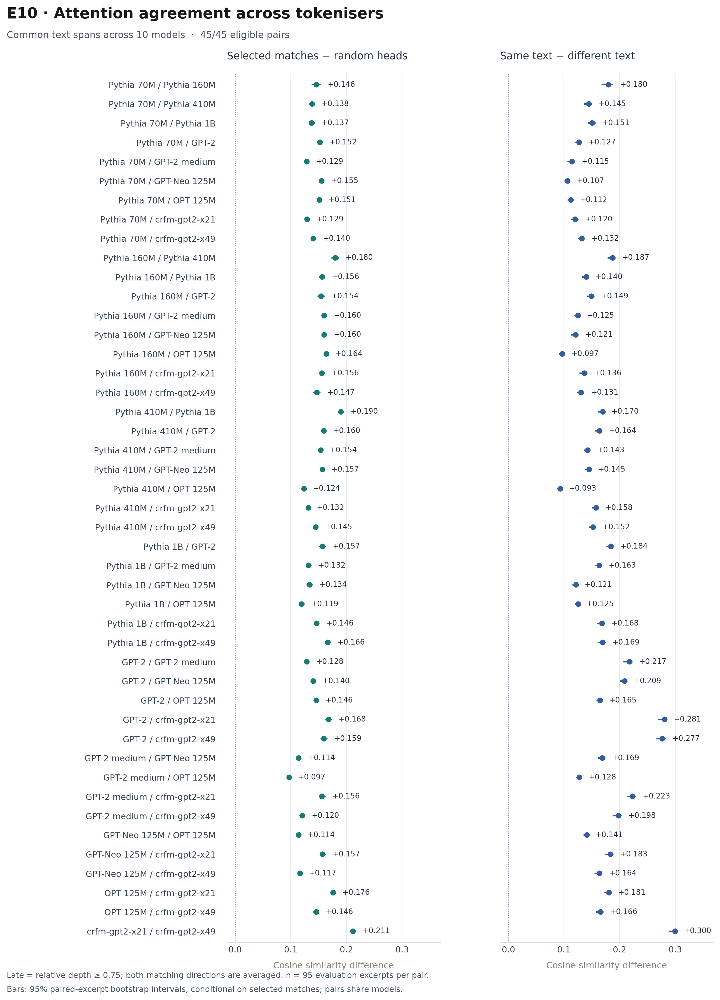
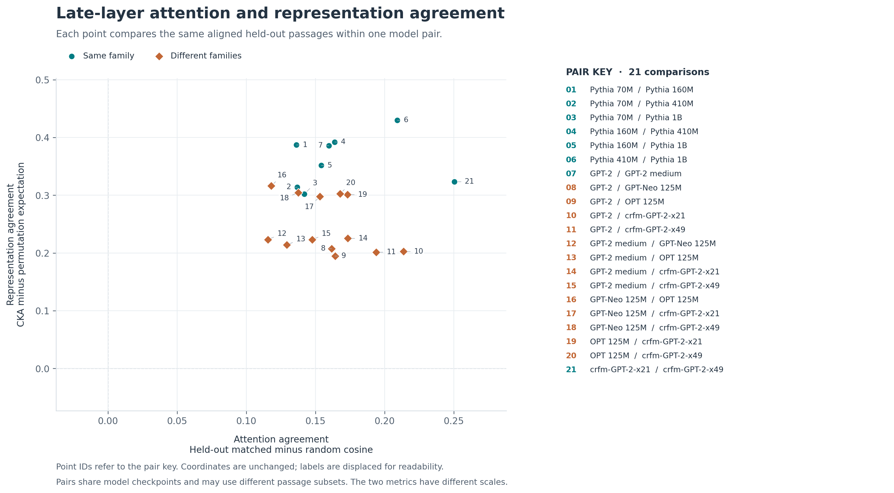

# attnconverge

Measuring agreement between the attention patterns of ten transformer language models from four organisations, 70M to 1B parameters: four Pythia sizes, GPT-2, GPT-2-medium, GPT-Neo, OPT and two Stanford CRFM GPT-2 reproductions. Individual heads are compared across model size, depth, input and tokeniser, motivated by the [Platonic Representation Hypothesis](https://arxiv.org/abs/2405.07987).

## Why attention can be compared across models

Hidden states live in each model's own coordinate system. Pythia-70m uses 512 dimensions and 410m uses 1024, and even where the widths match, a coordinate has no guaranteed correspondence across models. An element-by-element comparison therefore has no shared basis.

Attention matrices are indexed by positions in the text instead. When token boundaries match, each cell describes attention between the same pieces of text in both models. Equal token counts alone are insufficient, and E8 checks the boundaries explicitly. Models with different tokenisers never share boundaries; E10 replaces token cells with 16 text spans that every model's tokenisation respects, which restores a common index at coarser resolution.

The quantity measured throughout is attention allocation. Agreement in the geometry of hidden representations is a separate comparison, made in E9.


Both heads attend mainly to the current token, despite occupying different head indices.

## Method

Each head in one model is compared with every eligible head at the corresponding relative depth in the other. Cosine similarity is averaged across the text set, keeping the best match for each source head. Head indices follow from initialisation and carry no meaning across models, so the comparison runs all against all rather than by index.

Three properties of attention matrices distort that comparison if they are left in. The upper triangle is zero under the causal mask, so including it would add a large block of agreeing cells to every pair. Most heads place heavy weight on the first token, so a near-full first column matches a near-full first column whatever either model has learned. A head that puts almost everything on token 0 performs no routing at all, and every such head resembles every other one. The vectors therefore hold causal entries only, the first-token column is removed, and sink-heavy heads are excluded above a cutoff: 0.9 in E5-E8 and E10, with 0.7, 0.8 and 1.0 as sensitivity checks.

Write $v(A)=\big(A_{ij}\big)_{1\le j\le i\le n-1}$ for the vector of cells those exclusions leave, and $v_a(x)$ for the vector of head $a$ on passage $x$. Head agreement is cosine similarity between these vectors, averaged over the passage set $X$:

$$s(a,b)=\frac{1}{|X|}\sum_{x\in X}\frac{\langle v_a(x),\,v_b(x)\rangle}{\| v_a(x)\|\,\| v_b(x)\|}$$

Two heads drawn at random already agree to roughly 0.44, so every number below is a gap over that baseline rather than a raw similarity. Each source head takes its best target among the eligible heads $B(a)$ at the nearest relative depth, and a random eligible head $r(a)$ is drawn at the same depth:

$$\hat b(a)=\arg\max_{b\in B(a)}\;s_{\mathrm{sel}}(a,b),
\qquad
\Delta=\frac{1}{|A|}\sum_{a\in A}\Big(s_{\mathrm{eval}}\big(a,\hat b(a)\big)-s_{\mathrm{eval}}\big(a,r(a)\big)\Big)$$

E3-E7 select and evaluate matches on the same fifty sentences, so $s_{\mathrm{sel}}$ and $s_{\mathrm{eval}}$ are one and the same average, and a positive gap there describes the selected matches on that text set only. E8 separates the two: matches, random targets and sink exclusions are fixed on one text set and scored on a held-out set, on the same passage and on every mismatched passage pairing. Both matching directions are averaged, and early and late mean the first and last quarters of relative depth. E10 repeats the E8 protocol on the span basis. For OPT, BOS mass is recorded before its row and column are removed and the remaining attention is renormalised over content tokens.

E9 measures a second quantity on the same pairs. For centred Gram matrices $\tilde K$ and $\tilde L$ of the two models' final-content-token hidden states, each normalised to unit Frobenius norm, linear CKA and its permutation expectation are

$$\mathrm{CKA}=\langle \tilde K,\tilde L\rangle_F,
\qquad
\mathbb{E}_{\Pi}\big[\langle \tilde K,\Pi\tilde L\Pi^{\!\top}\rangle_F\big]=\frac{\mathrm{tr}\,\tilde K\,\mathrm{tr}\,\tilde L}{n-1}$$

and the excess CKA reported below is the first minus the second. The expectation runs over uniform permutations of the example labels and is evaluated in closed form rather than sampled. Examples are the observations, so models of different width are comparable without a shared basis across their dimensions.

## Results

Attention heads have counterparts across model size, across independently trained families and across tokenisers. Under identical token boundaries, 21 of the 45 pairs are scorable, and every one keeps a positive late-layer gap over random heads on held-out text, from +0.116 to +0.250. On the span basis all 45 are scorable and all 45 are positive, from +0.097 to +0.211, including the 24 pairs that cross the Pythia and GPT-2 vocabularies at +0.119 to +0.166.



Each point is one model pair; bars show 95% paired-excerpt bootstrap intervals with the head matches held fixed.

The largest gap in both comparisons belongs to the two CRFM models, which share architecture, training data and recipe and differ only in random seed: +0.250 late against +0.214 for the next pair under identical boundaries, and +0.211 against +0.190 on spans. Two runs of one recipe therefore set a reference level that no cross-family pair reaches, and it is the comparison the earlier experiments had no way to make.



Agreement weakens with depth and stays above the random-head baseline. Nineteen of the 21 held-out pairs have a smaller late than early gap; Pythia-410m against 1b instead rises from +0.175 to +0.209, and Pythia-70m against 1b from +0.114 to +0.142. In Pythia-70m and 160m, declining attention entropy accompanies increasing concentration on the first token. That concentration inflates raw similarity, and the correspondence is still present once it is removed: every held-out late gap stays positive at sink cutoffs 0.7, 0.9 and 1.0.

A substantial part of the agreement does not depend on the input. For the six non-Pythia pairs of the original eight-model panel, the early gap over random heads averages +0.214 on the same text and +0.172 on different text; the late averages are +0.141 and +0.035. Much of the early correspondence persists under input replacement, while late correspondence is more input-sensitive. Across the 21 held-out pairs, late matched similarity is +0.153 to +0.374 higher on the same text, and across the 45 span-basis pairs +0.093 to +0.300.

Repeating each passage's first eight-token prefix lowers the late gap by 0.016-0.063 in every held-out pair, and in 44 of the 45 span-basis pairs by up to 0.076. Head mappings stay fixed in this paired comparison, and the edited input changes content and lexical diversity alongside repetition.

Relative depth aligns layers only approximately. On the fifty-sentence set it identifies the best-matching layer for three of six layers between Pythia-70m and 160m, and five of twelve between GPT-2 and GPT-Neo. GPT-2's final layer matches GPT-Neo's second layer more closely than its own final layer, so similar attention patterns can sit at substantially different depths.


Representation agreement does not predict attention agreement. Linear CKA between each pair's final-content-token hidden states, with its exact permutation expectation subtracted, correlates at +0.055 with the late attention gap over the 21 pairs carrying both measurements. GPT-2 against CRFM x21 has the second-highest attention gap and one of the lowest CKA values; GPT-2 against GPT-2-medium reverses both. Wu et al. (2020) reported the same separation between the two signals.



See full numbers in [`observations.md`](observations.md).

See design choices in [`decisions.md`](decisions.md).

## Limitations

The negative late gap reported in E3 and E4 is not reproduced under the later protocol. Those experiments measured −0.272 at relative depth 0.8 between Pythia-70m and 160m, with matches selected and evaluated on the same fifty sentences. With selection held out and the full panel scored, every late gap is positive. Agreement declines with depth and stays above the random-head baseline at every depth measured.

The associations with model size are not stable across panels. Late gap correlates with log smaller-model size at +0.700 over the twelve pairs of the original eight-model panel, +0.401 over E8's 21 and +0.221 over E10's 45; with log size ratio at −0.086, −0.347 and −0.229; and with mean excluded-head share at +0.453, +0.212 and +0.322. Among the six Pythia pairs alone, log size ratio correlates at −0.836 with early agreement. The panels differ in text, baseline and depth summary as well as in membership, so these correlations describe the pairs that were scored and do not isolate an effect of scale or sinks.

Concentration on the first token is reduced by the preprocessing but is not removed from the measurement. Dropping the first-token column and excluding sink-heavy heads lowers every gap, and in the held-out comparisons each late gap is positive at all three cutoffs, with OPT against CRFM x49 at +0.006 for cutoff 0.7.

The depth profiles of E8 and E10 are not comparable. E10 has 29 of its 45 pairs higher late than early, against 2 of E8's 21. Summing key weights within spans removes routing below the span boundaries, and much of the early-layer correspondence is carried there. The two profiles are measurements of different quantities.

## Run

From the repository root:

```bash
python3 -m venv .venv
source .venv/bin/activate
python -m pip install -r requirements.txt
```

The pinned dependencies were checked with Python 3.9. Extract the model outputs once, then run an experiment:

```bash
python -m src.attnlib.extract
python -m src.experiments.e8_heldout
```

The first extraction downloads the model weights. Later runs reuse outputs in `results/attention_cache/`. Each experiment prints its measurements and writes figures to `results/`, for example `results/e8/` for the held-out comparison. The later experiments run the same way:

```bash
python -m src.experiments.e9_representations
python -m src.experiments.e10_cross_tokenizer
```

E8 and E10 read three plain-text files, with one excerpt per line:

- `data/selection.txt`: 100 excerpts used to choose head matches.
- `data/evaluation.txt`: 100 held-out excerpts used to test them.
- `data/repetition.txt`: 100 repeated variants, paired with evaluation excerpts by line number.

The supplied excerpts have 32 tokens under the Pythia tokeniser. Sources, preparation settings and licences are listed in [data/README.md](data/README.md).

To prepare your own text, set `SELECTION_SOURCE` and `EVALUATION_SOURCE` in `src/prepare_data.py` to separate text pools, one paragraph per line. Then run:

```bash
python -m src.prepare_data
python -m src.attnlib.extract
python -m src.experiments.e8_heldout
```

Preparation replaces the three input files. `N_SELECTION` and `N_EVALUATION` set the sample counts. For different file locations, update `SELECTION`, `EVALUATION` and `REPETITION` in preparation, extraction and the experiments; relative paths, absolute paths and `~/` paths work. Keep `N_TOKENS` consistent across these files if changing excerpt length.

Run the tests with:

```bash
python -m unittest discover -s tests -t .
```

## Next

The passages are 32 tokens long. Whether the correspondence holds over longer contexts, where heads have more structure to route over, is untested.

What the matched heads follow is also untested. The measurements say that two heads distribute their attention alike; they do not say what either head is attending to.

## References

- Huh et al., [The Platonic Representation Hypothesis](https://arxiv.org/abs/2405.07987), 2024.
- Wu et al., [Similarity Analysis of Contextual Word Representation Models](https://arxiv.org/abs/2005.01172), 2020.
