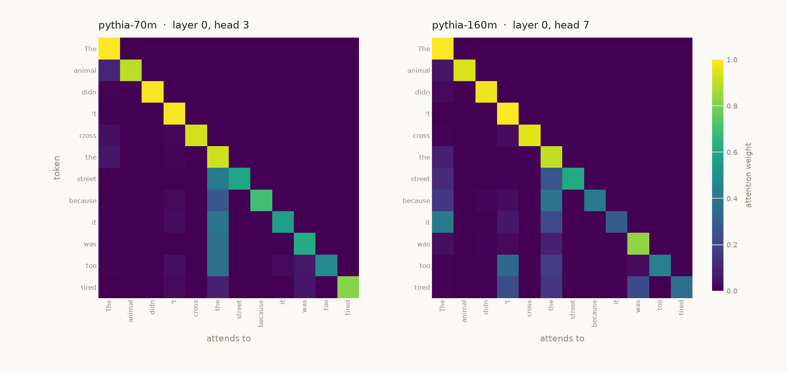
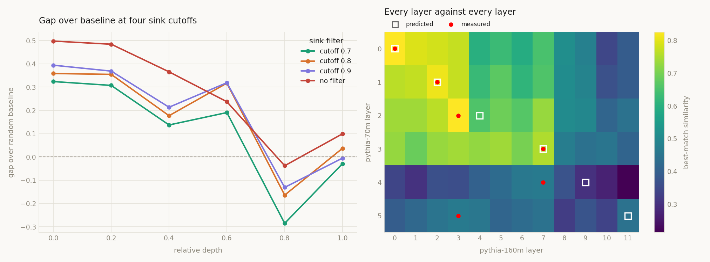

# attnconverge

Testing representational convergence (Platonic Representation Hypothesis) on attention patterns across the Pythia model family. The purpose of the research is measuring the agreement between attention patterns of different large language models across scale, depth, and individual heads.

## Why attention can be compared across models

Hidden states live in each model's own coordinate system. Pythia-70m uses 512 dimensions and 410m uses 1024, and even where the widths match, dimension 37 in one model has nothing to do with dimension 37 in another. There is no shared basis, so an element-by-element comparison produces a number with no interpretation.

Attention is different, since every head produces an n × n matrix whose rows and columns are indexed by the tokens of the sentence. Feeding the same sentence to two models with the same tokeniser produces matrices of the same shape with the same meaning per cell.



Both are previous-token heads, at different head indices in the two models.

## Method

Every head in one model is compared against every head in the other by cosine similarity over their attention matrices, averaged across a fixed set of fifty sentences, keeping the best match for each head. Head numbering follows from initialisation and means nothing across models, so the comparison runs all against all rather than by index. Layers are paired by relative depth.

Three things had to be corrected before any of that produced a usable number. The upper triangle of every attention matrix is zero because of the causal mask, so including it would add hundreds of perfectly agreeing cells to every comparison. Both models put most of their late-layer weight on the first token, so a near-full first column matches a near-full first column whatever either model has learned. And a head that places nearly everything on token 0 is doing no routing at all, which means every such head resembles every other one regardless of the model it came from. For these reasons, only the lower triangle is used, column 0 is dropped, and sink-heavy heads are excluded.

Two heads picked at random already agree to roughly 0.44, so everything is reported as the gap over that baseline rather than as raw similarity.

## Results

Heads in one model have counterparts in the other in the early layers and not in the late ones. Best-match similarity reaches 0.824 at the first layer pair, a gap of +0.325 over the baseline, then narrows through the middle of the stack and turns negative in the final third. The same shape appears at every sink cutoff including none.

Relative depth pairs the layers correctly for the first two thirds of the stack. The last two layers of 70m score 0.464 against a floor near 0.44, wherever they are compared.



See full numbers in [`observations.md`](observations.md).

See design choices in [`decisions.md`](decisions.md).

## Run

```bash
python -m src.experiments.e3_head_matching
```


Attention is cached to `results/` after the first run, since extraction takes several minutes.


```
data/               sentence sets
src/attnlib/        shared metrics, matching and extraction
src/experiments/    one file per experiment
results/            figures and cached attention (gitignored)
```

## Next

Further Pythia sizes, testing whether agreement grows with scale as the Platonic Representation Hypothesis claims for representations. Models that share a tokeniser but nothing else, testing whether convergence survives independent training.

## References

Huh et al., *The Platonic Representation Hypothesis* (2024), arXiv:2405.07987

Wu et al., *Similarity Analysis of Contextual Word Representation Models* (2020), arXiv:2005.01172